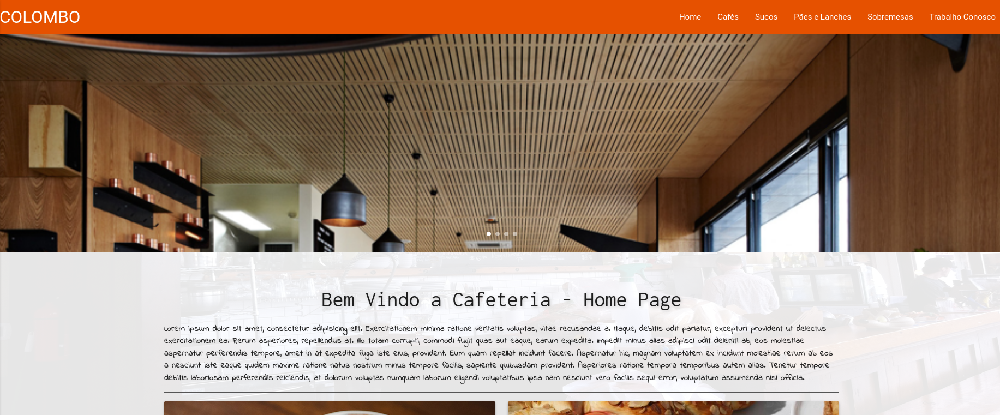
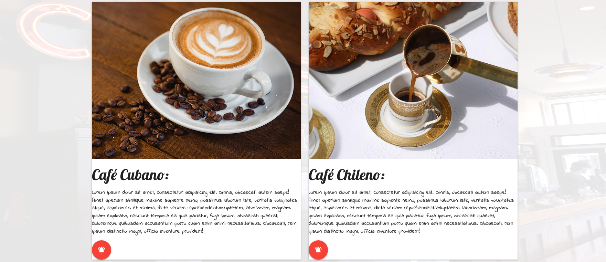
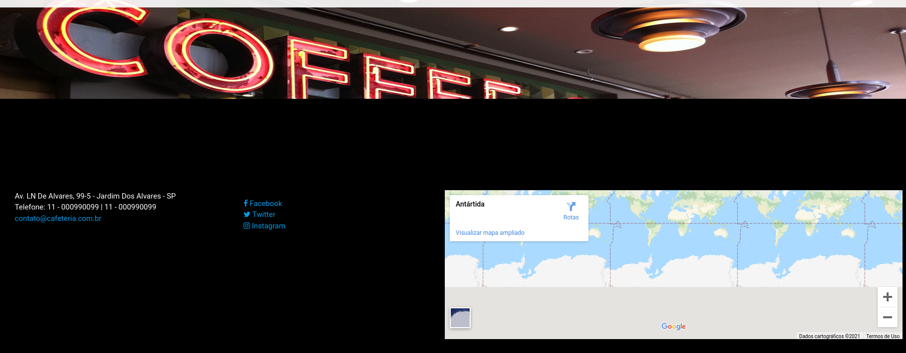
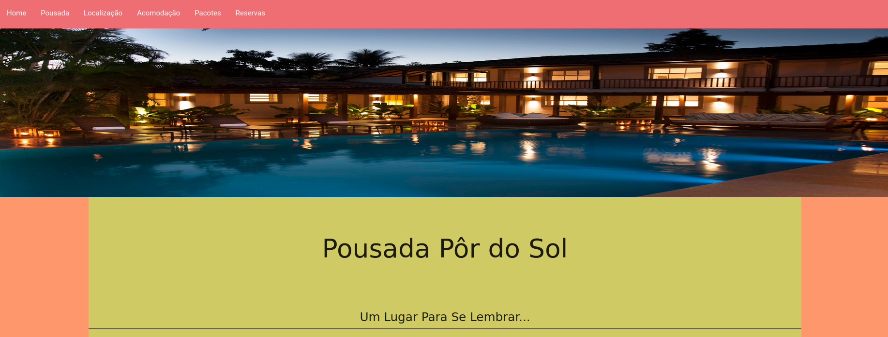
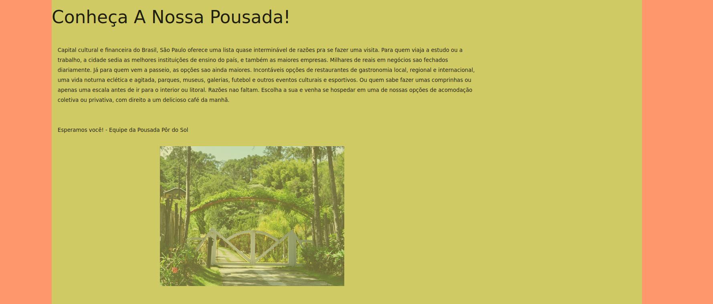
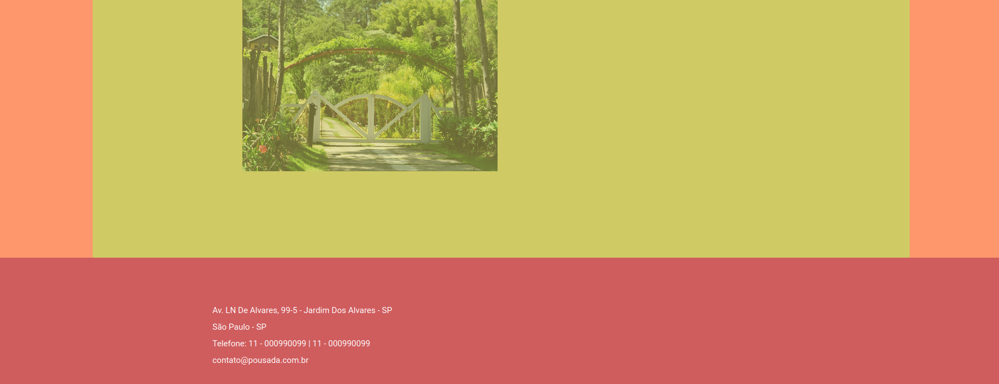
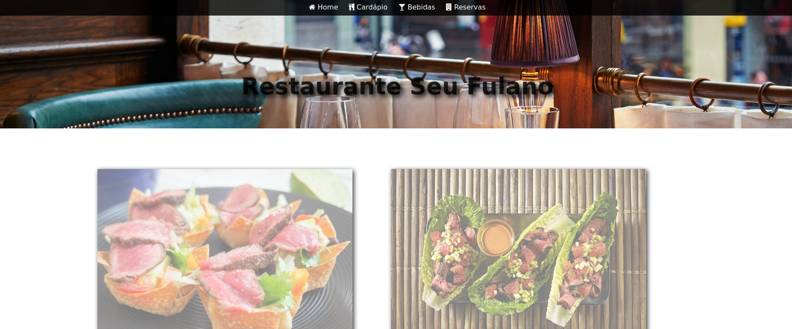
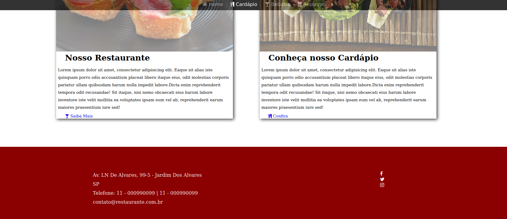

# Projetos Web feito durante o Curso Técnico em 2017 - 18

  
:hugs: PROJETO CAFETERIA  

 

<a href="https://github.com/phenomenalpotato/Projetos-Web/tree/master/Cafeteria"> Cafeteria </a>

 

  
:relaxed: PROJETO POUSADA  

 

<a href="https://github.com/phenomenalpotato/Projetos-Web/tree/master/Pousada"> Pousada </a>

 

 

  
:yum: PROJETO RESTAURANTE  

 

<a href="https://github.com/phenomenalpotato/Projetos-Web/tree/master/Restaurante"> Restaurante </a>

